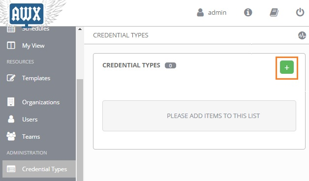

<!--https://www.unixarena.com/2018/12/ansible-tower-awx-store-credential-custom-credentials-type.html/-->


`Inputs` define the value types that are used for this credential – such as a username, a password, a token, or any other identifier that’s part of the credential.

`Injectors` describe how these credentials are exposed for Ansible to use – this can be Ansible extra variables, environment variables, or templated file content.

# How to
Creating the Custom Credential type in Ansible Tower/ AWX: 
1. Login Ansible Tower/AWX with administrator privileges.

2. Navigate to custom credential type and click on “+” to create new.
<p align="center">
  
</p>

3. Update the input & inject fields with desired values.  In this example, I am creating the custom credential type for Jenkins authentication.
<p align="center">
  
</p>

Input:
```
fields:
  - type: string
    id: username
    label: Jenkins username

  - type: string
    id: password
    label: "Jenkins password"
    secret: True

required:
  - username
  - password
```

Injector:
```
extra_vars:
  Jenkins_username: '{{ username }}'
  Jenkins_password: '{{ password }}'
``` 

4. Here is the newly created credential type.
<p align="center">
  
</p>

5. Navigate back to Credential. Create a new credential for Jenkins portal authentication.  Click on the Credential type’s search box.
<p align="center">
  
</p> 

6. Select the credential type which we have created for Jenkins.
<p align="center">
  
</p>

7. Enter Jenkins username & password to authenticate to the portal.
<p align="center">
  
</p>

8. In your playbook, you need to call the injector’s extra-vars for successful authentication. Refer step : 3 to know the extra_vars.

Example:
```
  - name: Create a Jenkins job creation using Ansible playbook
     jenkins_job:
         config: "{{ lookup('file', '/tmp/jenkinsjob.xml') }}"
         name: Jenkinsdemo
         user: "{{ Jenkins_username }}"
         password: "{{ Jenkins_password }}"
         url: http://192.168.3.142:8080
```

9. Add Jenkins credential in playbook template if your job requires Jenkins authentication. We have successfully created custom credential type and created new credentials using that.


# Credentials Type
## Jenkins 
### Input:
```
fields:
  - type: string
    id: username
    label: Jenkins username

  - type: string
    id: password
    label: "Jenkins password"
    secret: True

required:
  - username
  - password
```

### Injector:
```
extra_vars:
  Jenkins_username: '{{ username }}'
  Jenkins_password: '{{ password }}'
```
