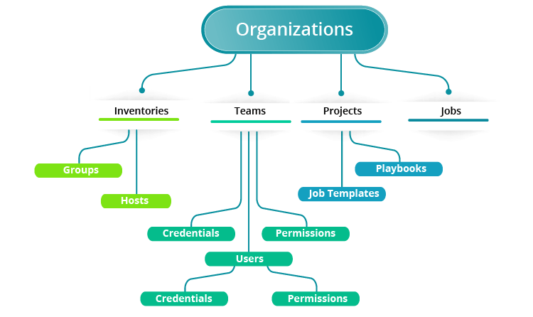

# Ansible-AWX
<!-- https://medium.com/swlh/ansible-awx-installation-5861b115455a -->

<p align="center">
  
</p>

## Prerequisites:
In order to deploy AWX Docker image on a CentOS 7 box, with python 3.6 you need to have at least 4GB memory and 20GB disk space. If you decided to use AWX on production, you need to take a look [Tower’s requirements page](https://docs.ansible.com/ansible-tower/2.2.2/html/installandreference/requirements_refguide.html) for more information.

# run
The username & password here will be the user for AWX login.

```
./00-run.sh username password
```
