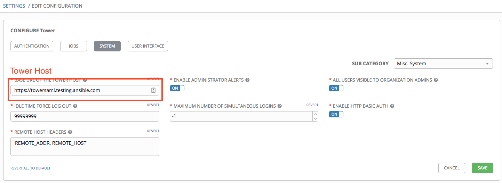

<!-- https://www.ansible.com/blog/using-saml-with-red-hat-ansible-tower -->

Getting Ansible Tower to interoperate with OneLogin SAML requires both systems to have values from each other. This blog post is separated into three sections: the interdependent fields of the two systems, a detailed walkthrough of configuring OneLogin and Ansible Tower with both interdependent and per-system fields and values, and the troubleshooting of potential misconfigurations and corresponding error messages in Ansible Tower.

# Interdependence of Ansible Tower and OneLogin
## Defined in Ansible Tower, needed by OneLogin:

- ACS URL
- Entity ID

## Defined in OneLogin, needed by Ansible Tower:

- Issuer URL
- SAML 2.0 Endpoint (HTTP)
- X.509 Certificate

## Ansible Tower and OneLogin Definitions

|Ansible Tower | OneLogin|
|-------------|---------------|
| SAML ASSERTION CONSUMER SERVICE (ACS) URL | ACS (Consumer) URL
| SAML SERVICE PROVIDER ENTITY ID           |Audience
| SAML ENABLED IDENTITY PROVIDERS (python dictionary where entity_id is the “magic” key) | Issuer URL
| SAML ENABLED IDENTITY PROVIDERS (python dictionary where url is the “magic” key) | SAML 2.0 Endpoint (HTTP)
| SAML ENABLED IDENTITY PROVIDERS (python dictionary where x509cert is the “magic” key)* | X.509 Certificate

The multi-line One Login x.509 cert needs to be made into a single line via https://www.samltool.com/format_x509cert.php


# How to configure Ansible Tower and OneLogin
## Ansible Tower

- Set the AWX Host (Settings --> System)
<p align="center">
  
</p>

- Set the Saml Service Provider Entity ID (Settings --> Authentication)
- AWX ACS URL is auto-generated in tower by concatenating Host + /sso/complete/saml/
<p align="center">
  
</p>

To summarize, there are now two fields in AWX that will be used by OneLogin

| Ansible Tower Field | Value |
|---------------------|-------|
| ACS URL	            | https://awx.testing.ansible.com/sso/complete/saml/
| Entity ID*          | awxsaml

* You can set Entity ID to whatever you want.

# config Onelogin ....

removed..

# Ansible Tower
Information in this step will not be used in OneLogin, but we need to do it anyway in order to make things work anyway.

On the command-line run:
```
openssl req -new -x509 -days 365 -nodes -out saml.crt -keyout saml.key
```

- Paste the contents of saml.crt into the SAML Service Provider Public Certificate box
- Paste the contents of saml.key into the SAML Service Provider Private Key box
- Save it

<p align="center">
  
</p>

# Ansible Tower
There are six boxes left to fill in for the SAML section of the authentication page in Ansible Tower. We will be filling in five of those six boxes.

<p align="center">
  
</p>

| Field | Value |
|-------|-------|
|SAML Service Provider Organization Info | 
{
  "en-US": {
    "url": "https://whocares.com",
    "displayname": "This is only a name, it is not of importance",
    "name": "who cares it is not important"
  }
}

| SAML Service Provider Technical Contact | 
{
  "givenName": "Chris Meyers",
  "emailAddress": "cmeyers@redhat.com"
}

|SAML Service Provider Support Contact |
{
  "givenName": "Chris Meyers",
  "emailAddress": "cmeyers@redhat.com"
}

|IDP|
{
  "idp": {
    "attr_last_name": "User.LastName",
    "attr_username": "User.email",
    "entity_id": "https://app.onelogin.com/saml/metadata/721709",
    "attr_user_permanent_id": "name_id",
    "url": "https://ansible-redhat-dev.onelogin.com/trust/saml2/http-post/sso/721709",
    "attr_email": "User.email",
    "x509cert": "MIIEFzCCAv+gAzIBAgIUbGcx6GwUir5qLSP7MmZxq+zEURMwDQYJKoZIhvcNAQEFBQAwWDELMAkGA1UEBhMCVVMxEDAOBgNVBAoMB1JlZCBIYXQxFTATBgNVBAsMDE9uZUxvZ2luIElkUDEgMB4GA1UEAwwXT25lTG9naW4gQWNjb3VudCAxMTcwOTcwHhcNMTcxMTA1MTcxMzQxWhcNMjIxMTA2MTcxMzQxWjBYMQswCQYDVQQGEwJVUzEQMA4GA1UECgwHUmVkIEhhdDEVMBMGA1UECwwMT25lTG9naW4gSWRQMSAwHgYDVQQDDBdPbmVMb2dpbiBBY2NvdW50IDExNzA5NzCCASIwDQYJKoZIhvcNAQEBBQADggEPADCCAQoCggEBAOv1V+QQg/ypV+d36KyrfjjWi6B2o7D1elu4JrPsbO1uF/zLrls3Cxfur7bHsazLjj2cVtsNa3lrkUMQPHuAJ6RfwyNbHbuvnb/aFC/PprLabNDzITgLFajnUopI+vW1vHy1Qxm26Lsqoa/GDdN+knB8cRVZ3PMn+P16Mo1dOl7G5cCS0Hjw30q4PsCcGCPFoSsQNd4sPs1LbpOh7evR7YCIdWegukr52qNZmoJbBTUdktj+wFiC7a9kDw5Rv9SP64i+nYINJkRHL74/tK6hfCVIKSz90PzN4ekXeuwpIe+riASiSJCfhjYaZANjt24yf6z+lEKhvqf+0S3WIGQFnPkCAwEAAaOB2DCB1TAMBgNVHRMBAf8EAjAAMB0GA1UdDgQWBBQZhIKzMwqqBDjsthZfJRqVpneFbTCBlQYDVR0jBIGNgIGKgBQZhIKzMwqqBDjsthZfJRqVpneFbaFcpFowWDELMAkGA1UEBhMCVVMxEDAOBgNVBAoMB1JlZCBIYXQxFTATBgNVBAsMDE9uZUxvZ2luIElkUDEgMB4GA1UEAwwXT25lTG9naW4gQWNjb3VudCAxMTcwOTeCFGxnMehsFIq+ai0j+zJmcavsxFETMA4GA1UdDwEB/wQEAwIHgDANBgkqhkiG9w0BAQUFAAOCAQEA1gddAIRVNCLMF6Csib95cs4+wlHqOajLBX1WWzfm/Brp52KMBRADwJAI3TEWkdBOlZfK/WSuykAItL/Bx9rFtW0zIMJO6MFAUkdE2s1SdpleUPhBhMzVr4HdSByI2qvnhR6vJTNqv5tzXQUOgqeTYcs1VgGGJHACrOW4WJOlp9u9XlSZtz01o6Ro+Cfmi6wzQd5IUNURqbKN81Puj18SopD0V6+FFoOtk6a+Go3gQ+iuNshGUjaUJmYzRRMk6fbg+WP1Rv8Tjjkr7iqzuqnesKiGmxE2O4gOH26rgTFpo3xaChG9Vm5ugprKdpkckV2SQjpf95G6Ys2IET+lJCrjcA==",
    "attr_first_name": "User.FirstName"
  }
}

|Org Mapping|
{
  "Default": {
    "users": true
  }
}
|

Finished! Now you can login via Ansible Tower’s UI with any user accounts that you normally login with via SAML and they will be automatically imported to Ansible Tower. The section below walks through some common errors that you may run into along the way and reasons for these errors.
